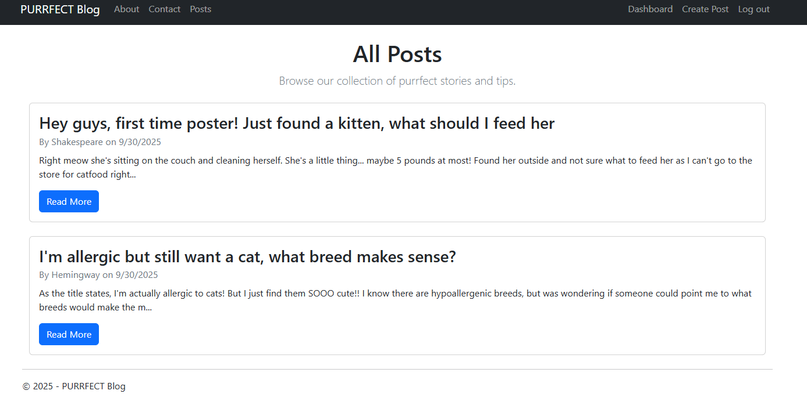
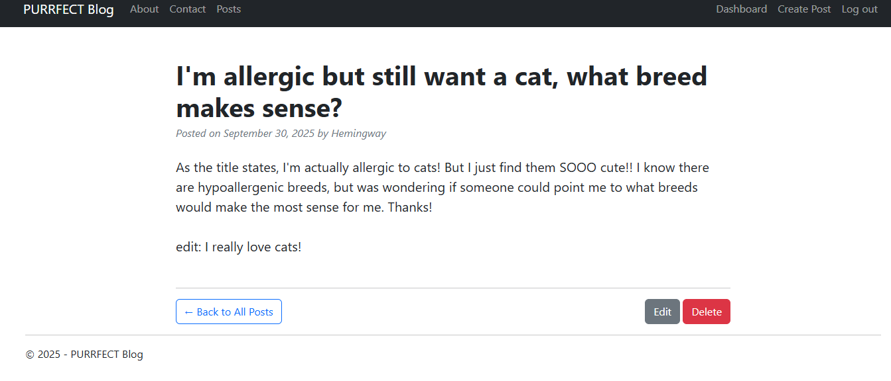
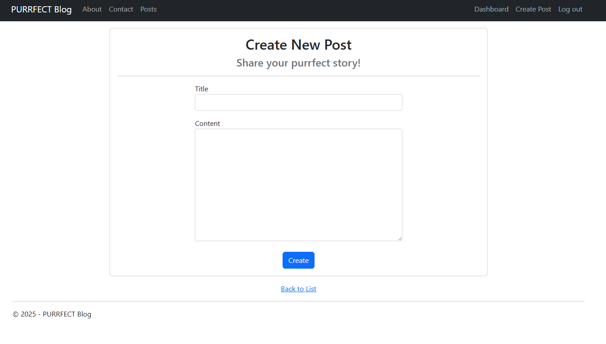

# Purrfect Blog 🐾

A classic, fully functional blog application built with ASP.NET MVC 5 and Entity Framework 6. This project demonstrates the core principles of a CRUD (Create, Read, Update, Delete) application, allowing users to register as authors, create posts about their feline friends (or enemies?), and manage their content in a secure and intuitive way.

### 📹 Demo Video
Watch the full demo video to see all features in action:

**Demo Credentials:**
- **Username:** Shakespeare
- **Password:** ToBeOrNotToBe123!
- **Username:** Hemingway
- **Password:** TheOldManAndTheSea123!
- **Username:** Herbert
- **Password:** LisanAlGaib123!

## 📖 About this Software

Purrfect Blog is a web application built using the ASP.NET MVC and Entity Framework. It was created as part of the Relativity Academy task. 

The core functionality allows authors to register, log in, and manage their own blog posts. Users can create posts, edit posts, delete posts, and view a list of all posts and individual post details.

### Features:

1.  **Full User Authentication:** Secure registration and login system for authors using ASP.NET Forms Authentication.
2.  **Complete Post Management (CRUD):** Authors have the ability to Create, Read, Update, and Delete their own blog posts.
3.  **Dynamic Home Page:** The home page automatically showcases the three most recent blog posts to all visitors.
4.  **Post Listing & Details:** A dedicated page lists all blog posts chronologically, and each post has its own detailed view page.
5.  **Author-Based Security:** Robust authorization checks are in place to ensure that authors can only edit or delete their own content.
6.  **Data Persistence:** Uses Entity Framework and a LocalDB SQL Server database to reliably store all user and post data.

### WIP:
1. **Adding test coverage**
2. **Add commenting**
3. **Add OAuth**
4. **Add upvotes/downvotes akin to sites like Reddit**
5. **Add searching for posts**

## 🖼️ Screenshots

To give you a visual overview of the application, here are some screenshots:

### Home Page

### Post Details Page

### Create/Edit Post Form

*Replace the placeholder links above with links to your actual screenshots.*

## ⚠️ Warning

**Changing the repository name is NOT allowed.** Renaming this repository can cause issues with the peer review feature integrated into this template.

If you're planning to present this project to potential employers or external parties:

1.  Ensure that all functionalities work as expected.
2.  **Remove this warning section** to maintain a clean and professional look.

## ✅ Best Practices to Follow

To ensure high-quality projects, we recommend adhering to the following best practices:

1.  **Gitflow:** Always use pull requests (PRs) for introducing new features or changes. This helps in maintaining a clean commit history and enables peer reviews.
2.  **Commit Formatting:** Follow a commit convention such as Git convention or [Conventional Commits](https://www.conventionalcommits.org/). It makes the commit history readable and easy to understand.
3.  **Test Coverage:** Aim for a minimum test coverage of 80-90%. This ensures that the majority of your code is tested, reducing potential bugs and regressions.
4.  **Comprehensive README:** A well-documented README provides clarity about the project's purpose, usage, and maintenance.
5.  **Live Demo:** Always provide a live demo with login credentials (if applicable). It offers a hands-on experience of your application to users or potential employers.
6.  **Continuous Integration (CI):** Implement CI to automatically build and test your project. This ensures that your code is always in a deployable state.
7.  **Continuous Deployment (CD):** While CI is a must, having CD is a nice-to-have feature. It automates the deployment process, ensuring that the latest changes are instantly accessible to users.
8.  **Clean Code:** Avoid clutter or "junk" in your code. Ensure that your codebase is organized, commented when necessary, and follows established coding standards.

---
